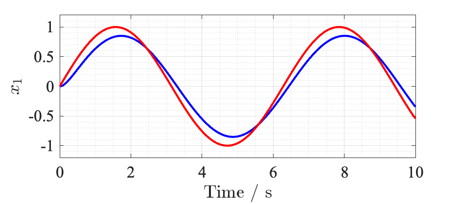
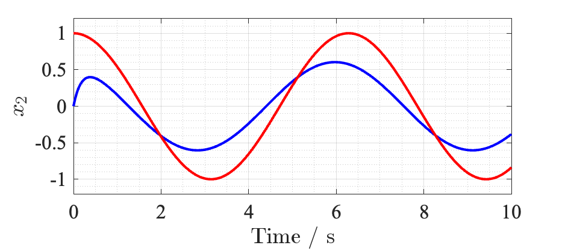
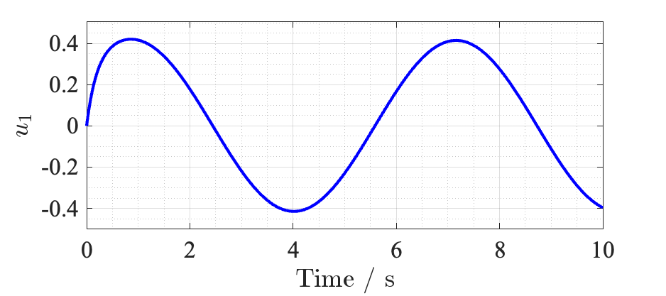
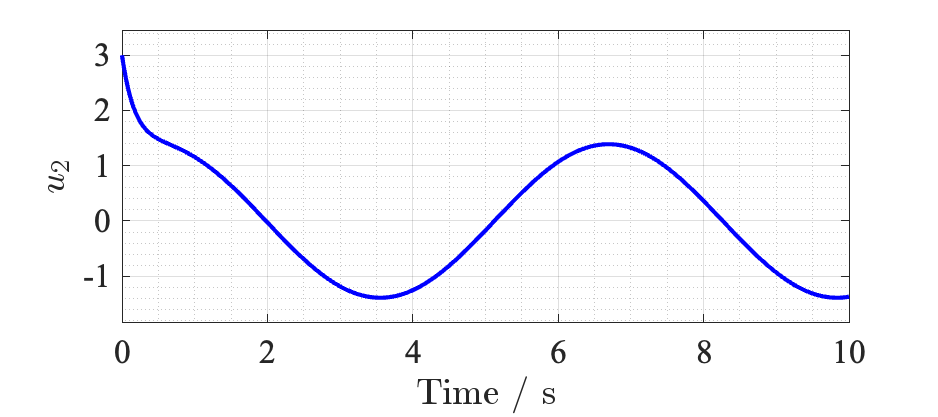

# Research Template for MIC Lab

This project is highly inspired by the work of LMRES Lab, Hochschule München.
Thank you very much my dear friend, Niklas Monzen, for your kind sharing and support.

## Description
 
The objectives of this research template are as follows:
- Save time to start numerical validation and writing.
- Every author in our lab uses same notations and symbols. (defined in [Template](https://github.com/KAIST-MIC-Lab/template).)
- 

## Tables of Contents

```
. (may differ;)
├── README.md                   // you are here
├── manuscript.tex              // template of conf.
├── localRefs.bib               // local bibtex file
├── template/                   // pre-defined template
├── figures/                    // general figures
├── public/                     // do not touch
├── doc/                        // local bibtex file
│   └── main.tex                // template of documentation
└── src/                        // source code
    ├── script_simulation       // script sim. example
    └── simulink_simulation     // simulink sim. example
```


## How to start

> If you have questions, please, please, let the author knows.

Download this remote repository on your local device.
```bash
git clone https://github.com/KAIST-MIC-Lab/Research-Template
```
Initialize submodule to download [Template](https://github.com/KAIST-MIC-Lab/template) repository.
> This command will download very recent version of [Template](https://github.com/KAIST-MIC-Lab/template)
```bash
git submodule add https://github.com/KAIST-MIC-Lab/template
git submodule init
git submodule update
```

I provide you the keywords that you can google what you need for what you want to do.

| Keywords 	    | Descriptions 	|
|---------	    |--------------	|
| branch       	| Want to      	|
NOT FINALIZED!

<!-- 
Talbe generator
https://www.tablesgenerator.com/markdown_tables
https://insight.infograb.net/blog/2025/01/22/gitlab-wiki/
-->

## Example research simulation and manuscript

> This simulation in `./src ` provides simple feedback control example.
> Please, read `src/script_simulation/main.m` and `src/simulink_simulation/main_slx.m` for script and Simulink simulations, respectively.
> When you run those scripts, the results and figures shall be saved in the directories named `results` and `figures` (of course, you need to check setting in the scripts.).

Consider following control-affine system represented as
$$
    \dot {\boldsymbol{x}} = \boldsymbol{A}\boldsymbol{x} + \boldsymbol{B}\boldsymbol{u}
$$
where $\boldsymbol{x}=[x_1;x_2]\in\mathbb{R}^2$ denotes state variables, $\boldsymbol{u}=[u_1;u_2]\in\mathbb{R}^2$ denotes control input variables, and $\boldsymbol{A}=[0,1;-2,-3]\in\mathbb{R}^{2\times2}$ and $\boldsymbol{B}=I_2\in\mathbb{R}^{2\times2}$ denote system and input matrices, respectively.
The initial condition are $\boldsymbol x\vert_{t=0} = [0;0]^\top$ and $\boldsymbol u\vert_{t=0} = [0;0]^\top$.

Suppose that we have smooth reference trajectory of $\boldsymbol{x}$ as follows:
$$
    \boldsymbol{r} 
    = 
    \begin{bmatrix}
        r_1 \\
        r_2
    \end{bmatrix}
    =
    \begin{bmatrix}
        \sin(t)\\
        \cos(t)
    \end{bmatrix}
    \in\mathbb{R}^2
$$
A feedback control law can be designed as follows:
$$
    \boldsymbol{u} = -\boldsymbol{K}\boldsymbol{e}
$$
where $\boldsymbol{e}\triangleq \boldsymbol{x}-\boldsymbol{r}$ denotes tracking error and $\boldsymbol{K}=\text{diag}([-2,-3])\in\mathbb{R}^{2\times 2}$ denotes control gain matrix.

Then the simulation results are plotted like below.






## Contribution guidelines

Please, keep in mind the objectives of this template written in this document.
If what you want to add or adjust is on personal purpose, please, modify in your repository not in this template directly.
Please contact the author before your contribution.
All contributions are welcome.

## Authors

- Ryu Myeongseok [@DDingR](https://gitlab.com/DDingR)


